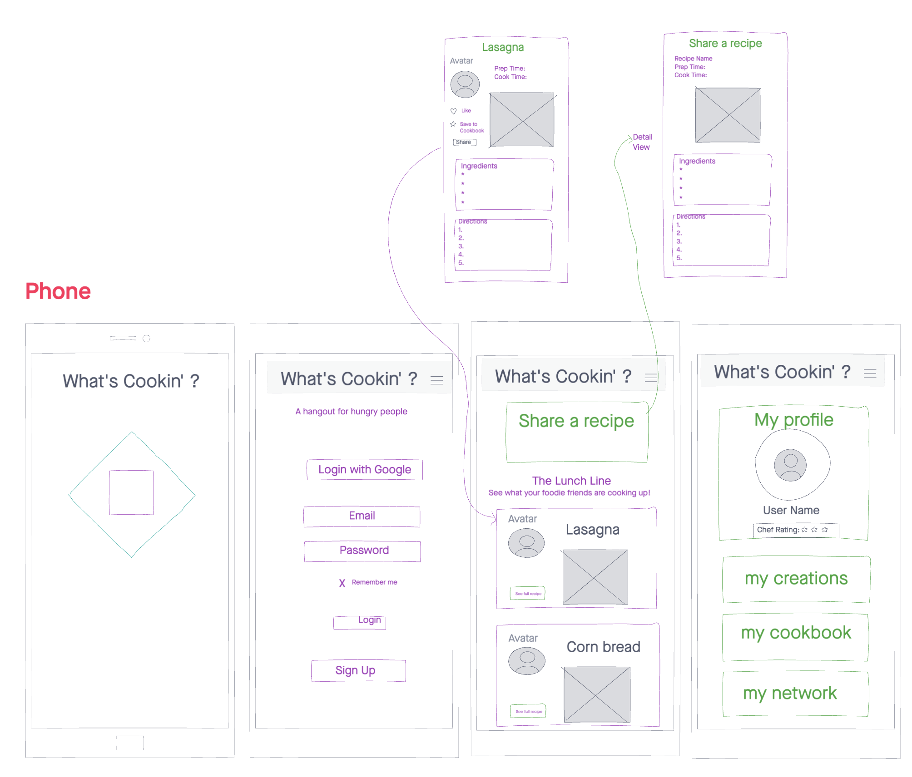
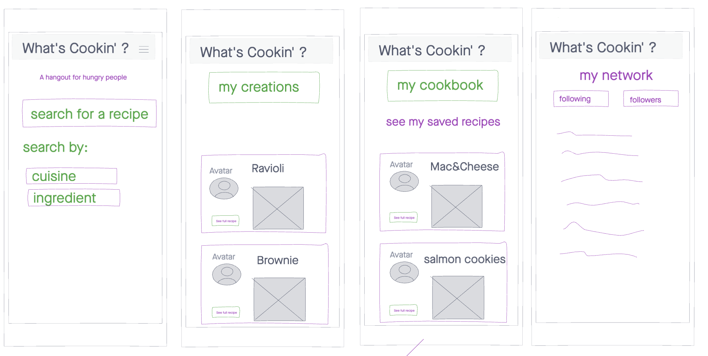
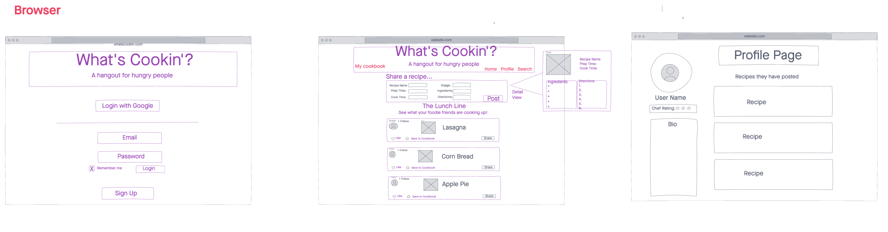
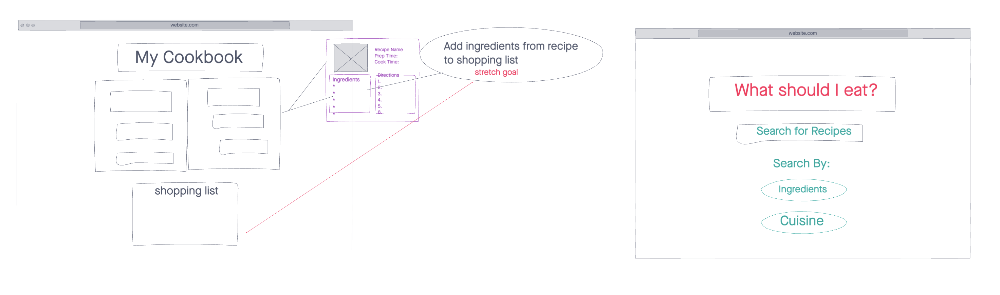

# Whats Cookin

## Table of Contents
- [Whats Cookin](#whats-cookin)
    - [Overview](#overview)
    - [Deployment](#deployment)
    - [Web Application](#web-app)
    - [Tools Used](#tools-used)
    - [Project Management Board](#project-management-board)
    - [Software Requirements](#software-requirements)
    - [Getting Started](#installation)
    - [UML Data Model](#uml-data-model)
    - [WireFrames](#-WireFrames)
    - [Usage](#-Usage)
    - [Approach to Testing](#approach-to-testing)
    - [Authors](#authors)
    - [Collaborations](#collaborations)
    - [License](#license)
    - [Acknowledgements / Resources](#acknowledgements-/-resources)

## Overview
This is our final project for Advanced Full-Stack Software Development in JavaScript.

## Deployment
We are deployed on Firebase <br/>
[What's Cookin'](https://whatscookin-4fd17.web.app/)

## Web Application
This web application consiss of a frontend written in React Redux, and Material UI. The backend was written in JavaScript, with a SQL database.

Have you ever been both hungry any lonely, but you don't know what to make or have anyone to talk to? Well now you have What's Cookin! A social network interface is proveided where you can create a profile, post your own new recipes, view existing recipes, and even search for recipes by ingredients you already have in your fridge to share (the recipe not your food)! If you find a recipe you love, save it to your very own cookbook to go back and look at whenever you are hungry! 

## Tools Used
VS CODE
* React
* Redux
* Axios
* Prisma
* SQLite
* Node.js
* Express

## Project Management Board
This project utilizes Trello Project Boards. You can visit this board and see agile practices in action by clicking the link below.
[Workflow Board]()


## Software Requirements
Please visit this link to view the [Software Requirements](./requirements.md)


## Getting Started
Clone this repository to your local machine. <br/>
``` 
git clone https://github.com/hot-bots/final-project.git 
```

Once downloaded you can use VS Code to build the web application. Then install dependencies needed.
``` 
cd final-project
npm i
```
The database is deployed [HERE](https://fathomless-reaches-67036.herokuapp.com/api)

Once in the project file use:
```
npm start
```

And it should be good to go!

## UML Data Model


## WireFrames

### Mobile view



### Browser view



## Usage


## Approach to Testing
In this application we are utilizing a testing library called `jest`. We have automated unit and integration tests for the current state of this application.
- `NOTE:` Anything you change / add on this application may or may not break these tests and that is the risk you have to take.
Currently this application is configured to run the following command
```bash
$ npm test
# OR
$ npm watch
```

## Authors
- Software Developer: Daisy Johnson
    - [Official Github](https://github.com/daisyjanejohnson)
- Software Developer: Joseph Zabaleta
    - [Official Github](https://github.com/joseph-zabaleta)
- Software Developer: Joshua Beasley
    - [Official Github](https://github.com/beasleyDOTcom)
- Software Developer: Lulu Sevignon
    - [Official Github](https://github.com/luluse)

## Collaborations
- none

## License
This project is under the [MIT License](./LICENSE).

## Acknowledgements / Resources

